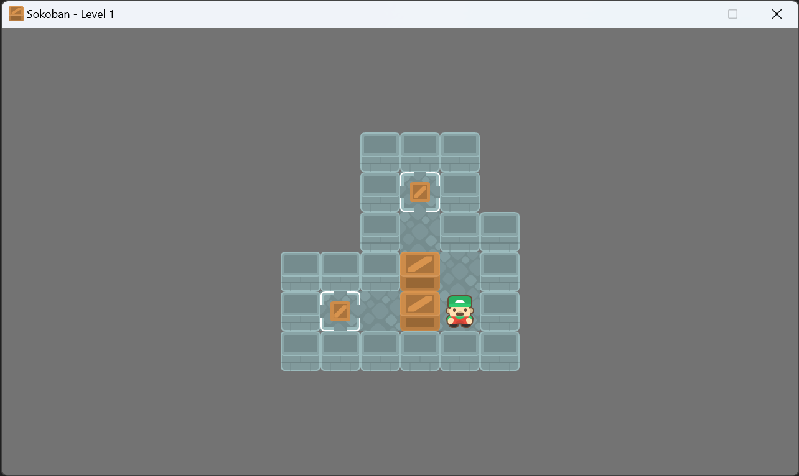

# Sokoban

A simple sokoban, using [SFML] framework.  

## Keymap

| Key                                        | Action                                                                 |
| ------------------------------------------ | ---------------------------------------------------------------------- |
| `W`/`A`/`S`/`D`/`Up`/`Down`/`Left`/`Right` | Move the character                                                     |
| `Esc`                                      | Reload current level                                                   |
| `BackSpace`                                | Single step undo                                                       |
| `P`                                        | Demonstrate how to pass the level (if the level comes with the answer) |

## Assets

- Image from [Kenney].
- Sound effect/music from [sinneschlösen]/[Pixabay].

[SFML]: https://github.com/SFML/SFML
[Kenney]: https://www.kenney.nl/assets/sokoban
[sinneschlösen]: https://pixabay.com/users/sinneschlösen-1888724/?utm_source=link-attribution&amp;utm_medium=referral&amp;utm_campaign=music&amp;utm_content=117362
[Pixabay]: https://pixabay.com/sound-effects/?utm_source=link-attribution&amp;utm_medium=referral&amp;utm_campaign=music&amp;utm_content=6297
